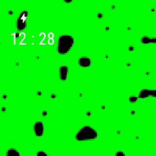

# art-watch
Android wear application which show GIF image on Tumblr onto your watch.

##### Android Wear
  
##### Android Device


## Setup
You have to setup to build project.

#### Prepare Tumblr app
1. Create your Tumblr app from [here](https://www.tumblr.com/oauth/apps)

#### Create secrets.properties file
1. Create `secrets.properties` file and place it under project directory
2. Set value
 ```
 TUMBLR_CONSUMER_KEY=your_tumblr_consumer_key
 TUMBLR_CONSUMER_SECRET=your_tumblr_consumer_secret
 ```
 
#### Prepare Firebase
1. Create Firebase project
2. Create two apps onto the project  
 These package names are `com.nomi.artwatch` and `com.nomi.artwatch.debug`
3. Download `google-services.json` and place it under `mobile` directory

## Build a new release app
[Create a new release](https://github.com/r21nomi/art-watch/releases/new), then Circle Ci start and new release app will be built.